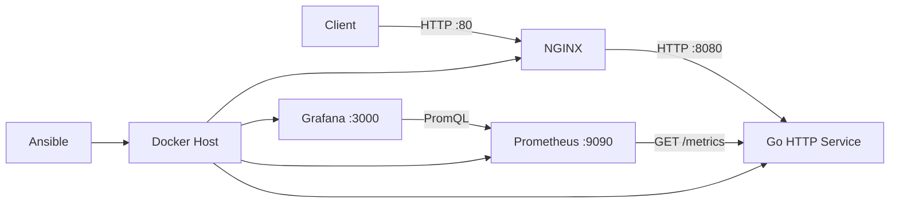

# Projeto Korp: DevOps Technical Challenge

[](https://go.dev/)
[](https://www.docker.com/)
[](https://www.ansible.com/)
[](https://prometheus.io/)
[](https://grafana.com/)

**Projeto Korp** is a containerized HTTP service built for a DevOps technical challenge. It combines Go, NGINX, Prometheus, Grafana, Docker Compose, and Ansible to demonstrate application packaging, reverse proxying, observability, Linux provisioning, and repeatable infrastructure automation.

The complete environment can be provisioned on a clean supported Linux host with a single Ansible command.

---

## Key Features

* **Containerized Go Service:** Multi-stage Docker build with a small runtime image and non-root execution.
* **NGINX Reverse Proxy:** Port `80` is the application entry point while the Go service remains internal to the Docker network.
* **Prometheus Metrics:** Request volume, HTTP status, and latency are exported in Prometheus format.
* **Grafana Provisioning:** Datasource and dashboard are created automatically from version-controlled files.
* **Ansible Automation:** Installs Docker, creates the bridge network, deploys the stack, and validates the services.
* **Idempotent Provisioning:** Re-running the playbook without configuration changes produces no infrastructure changes.
* **Continuous Validation:** GitHub Actions checks the Go code, Compose stack, service health, and Ansible syntax.

---

## Architecture



All containers share the external `korp-network` bridge network. The application itself does not publish port `8080` to the host.

---

## Tech Stack

* **Application:** Go 1.27
* **Reverse Proxy:** NGINX 1.30
* **Containerization:** Docker Engine and Docker Compose
* **Automation:** Ansible
* **Metrics:** Prometheus 3.14
* **Visualization:** Grafana 13.2
* **CI:** GitHub Actions

---

## Project Structure

```text
.
├── .github/workflows/ci.yml
├── ansible/
│   ├── inventory.ini
│   ├── site.yml
│   └── roles/
│       ├── docker/tasks/main.yml
│       └── korp_stack/
│           ├── defaults/main.yml
│           └── tasks/main.yml
├── app/
│   ├── cmd/server/
│   │   ├── main.go
│   │   ├── main_test.go
│   │   └── metrics.go
│   ├── Dockerfile
│   ├── go.mod
│   └── go.sum
├── grafana/
│   ├── dashboards/http-server-projeto-korp-dashboard.json
│   └── provisioning/
├── nginx/conf.d/http-server-projeto-korp.conf
├── prometheus/prometheus.yml
├── ansible.cfg
└── compose.yaml
```

---

## Provision with Ansible

This is the recommended deployment path.

The target host must be Debian or Ubuntu, have internet access, and provide Git, Ansible, and a user capable of becoming root with `sudo`. Docker does **not** need to be installed beforehand.

```bash
git clone https://github.com/cauafsantosdev/desafio-devops-korp.git
cd desafio-devops-korp

ansible-playbook ansible/site.yml --ask-become-pass
```

The playbook installs Docker from the official repository, creates `korp-network`, copies the deployment to `/opt/http-server-projeto-korp`, builds the application image, starts the complete stack, and validates the application, Prometheus, and Grafana.

To override the default Grafana admin password:

```bash
ansible-playbook ansible/site.yml --ask-become-pass -e 'grafana_admin_password=change-me'
```

---

## Run with Docker Compose

For manual execution, Docker Engine and Docker Compose must already be installed.

```bash
docker network create --driver bridge korp-network
docker compose up -d --build
```

Check the stack:

```bash
docker compose ps
```

Stop it and remove the monitoring volumes:

```bash
docker compose down --volumes
```

---

## HTTP Endpoints

### Application

```bash
curl http://localhost/projeto-korp
```

Example response:

```json
{
  "nome": "Projeto Korp",
  "horario": "2026-09-17T01:56:43Z"
}
```

`horario` is generated dynamically on every request in UTC using RFC 3339 format.

### Health Check

```bash
curl http://localhost/healthz
```

```json
{
  "status": "ok"
}
```

### Monitoring

* **Prometheus:** `http://localhost:9090`
* **Grafana:** `http://localhost:3000`
* **Application metrics inside the Docker network:** `http://http-server-projeto-korp:8080/metrics`

The Go service exports:

* `http_server_requests_total`
* `http_server_request_duration_seconds`

Grafana is provisioned automatically with the **HTTP Server - Projeto Korp** dashboard, containing service availability, request rate, total requests, mean and p95 latency, and HTTP status rate.

Default local Grafana credentials are `admin` / `admin`. For any non-local environment, override the password before deployment.

---

## Engineering Decisions

### NGINX as the Application Entry Point

The Go service does not expose port `8080` directly to the host. Requests reach it through NGINX, keeping the application isolated on the Docker network and ensuring that validation exercises the real reverse-proxy path.

### Ansible-Owned Docker Network

`korp-network` is declared as external in Compose and provisioned by Ansible. Host-level infrastructure remains the responsibility of Ansible while Compose manages the application services.

### Bounded Prometheus Labels

Known routes retain their path labels, while arbitrary URLs are normalized to `unmatched`. This avoids unbounded metric cardinality. Scrapes to `/metrics` are excluded from request metrics so monitoring traffic does not inflate application volume.

### Grafana as Code

The Prometheus datasource, dashboard provider, and dashboard JSON live in the repository. A fresh deployment therefore recreates the monitoring environment without manual Grafana configuration.

### End-to-End Deployment Validation

Ansible validates the application through NGINX, checks Prometheus and Grafana health, and executes a PromQL query to confirm that Prometheus is actually scraping the application target.

---

## Validation

The playbook was tested on a clean Debian 13.7 VM with Docker initially absent. The first execution installed Docker and provisioned the entire stack.

A later execution with no configuration changes completed with:

```text
changed=0
unreachable=0
failed=0
```

This verifies idempotent provisioning for the tested environment.

Useful local checks:

```bash
cd app
test -z "$(gofmt -l .)"
go vet ./...
go test ./...
cd ..

docker compose config --quiet
ansible-playbook --syntax-check ansible/site.yml
```

---

## Continuous Integration

GitHub Actions runs on pushes and pull requests targeting `main` and `dev`.

The workflow validates:

* **Go:** formatting, module integrity, `go vet`, and tests;
* **Docker Compose:** configuration, build, full stack startup, and HTTP availability of the application, Prometheus, and Grafana;
* **Ansible:** playbook syntax.

Container logs are printed automatically when the Compose validation fails, and the CI stack is always removed afterward.
